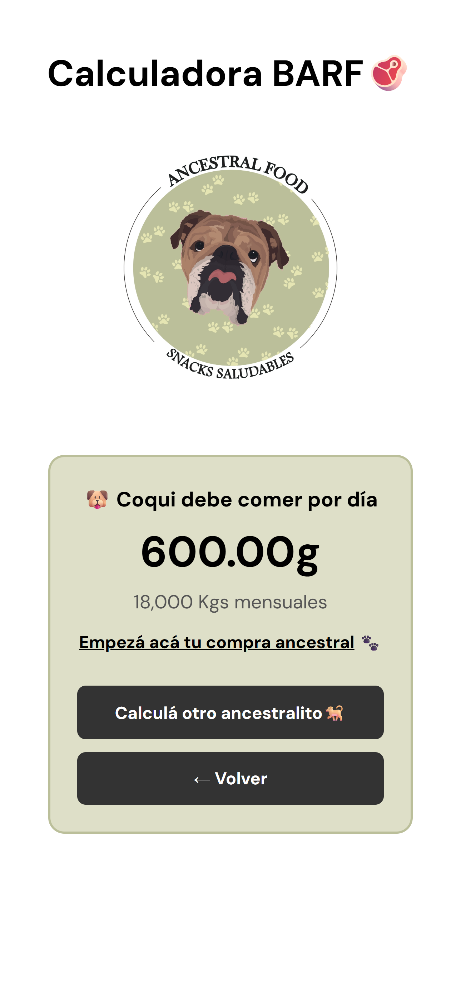

# 🐾 Ancestral Food - Calculadora BARF

### 📋 Descripción del Proyecto
Esta aplicación web permite a los clientes de Ancestral Food calcular con precisión la ración diaria y mensual de alimento BARF para sus perros. A través de un asistente por pasos, el sistema procesa variables físicas y de estilo de vida para devolver un resultado personalizado, optimizando la experiencia de compra y la salud del animal.

### 🚀 Demo en Vivo
Podes ver el proyecto funcionando acá: [https://barf-calculator.netlify.app/](https://barf-calculator.netlify.app)

### ✨ Características Principales
* **Asistente por Pasos (Wizard UX):** Desglose de entrada de datos en 5 pasos para reducir la carga cognitiva del usuario.

* **Contenido Dinámico:** Sugerencia inteligente de productos (ej. caldo de huesos) basada en la edad del perro (Senior).

* **Validaciones en Tiempo Real:** Sistema de alertas personalizado para asegurar que los datos ingresados sean válidos antes de avanzar.

* **Diseño Mobile-First:** Interfaz optimizada para usuarios que acceden mayoritariamente desde dispositivos móviles.

### 🛠️ Arquitectura de Software (Modular JS)
Para este proyecto, apliqué el principio de Separación de Responsabilidades (SoC), dividiendo la lógica en módulos independientes:
* **calculator.js:** Contiene exclusivamente el "motor" de cálculo y las constantes de negocio. No conoce nada del DOM.
* **ui.js:** Objeto encargado de la manipulación del DOM, transiciones de pasos, manejo de alertas y efectos de scroll.
* **main.js:** Orquestador que inicializa la aplicación y gestiona los eventos del usuario.

### 📐 Perspectiva de Análisis Funcional
Como Analista, identifiqué que el principal **pain point** era la incertidumbre del cliente sobre la cantidad de alimento a comprar.
* **Gestión de Excepciones:** Se implementó un "Disclaimer" inicial para filtrar casos fuera del alcance (cachorros, lactantes o con patologías), derivando la atención a profesionales.

* **Fricción de Usuario:** Se reemplazaron campos de texto libres por selectores visuales (grids de imágenes) para definir la condición física, minimizando errores de interpretación.

### 🧠 Lógica de Negocio y Reglas de Cálculo
El sistema no utiliza una fórmula lineal simple, sino un algoritmo basado en factores ponderados:
1. **Factores de Condición y Actividad:** Se asignan valores porcentuales según la condición física (delgado a sobrepeso) y estilo de vida del animal.

2. **Cálculo de Promedio Ponderado:** (valor_condicion + valor_actividad) / 2.

3. **Regla de Perros Pequeños:** Implementación de una regla especial donde perros de menos de 5kg reciben un ajuste metabólico (40g por kg).

4. **Proyección Mensual:** Conversión automática de gramos diarios a kilogramos mensuales, para facilitar la decisión de compra de viandas en cantidad.

## 🖼️ Vista del Proyecto

## 👨‍💻 Autor

Desarrollado por **Federico Rolla**

